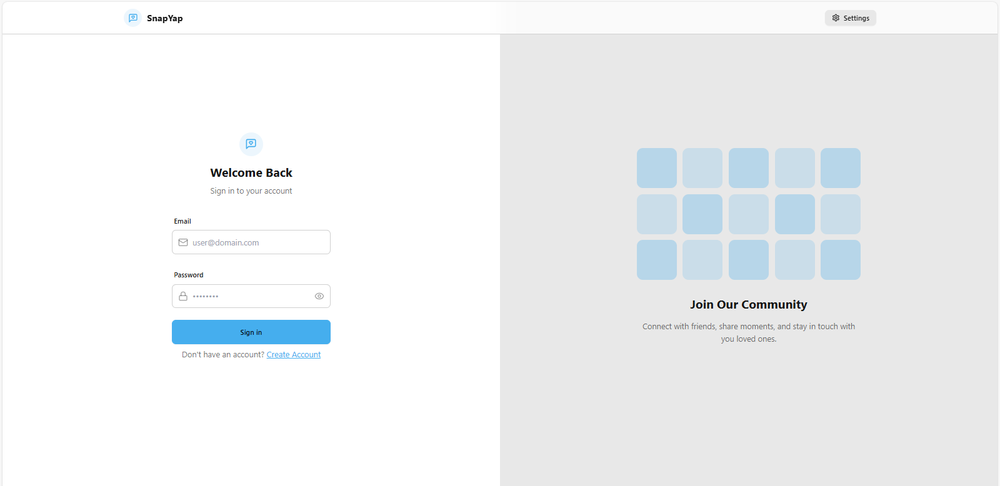
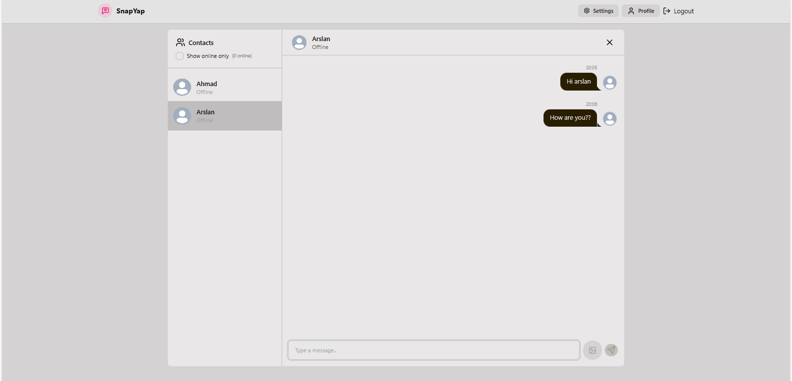

# 💬 MERN Chat Live Website

A real-time chat web application built using the MERN stack (MongoDB, Express.js, React, Node.js) with features like user authentication, cloud image upload, and socket-based live messaging.

---
## 🖼️ Screenshots

### 🔐 Login Page


### 💬 Chat Window

## 🚀 Features

- 🔒 JWT-based authentication (Signup/Login)
- 💬 Real-time messaging using Socket.io
- 📸 Profile image upload using Cloudinary
- ✅ Responsive design with modern UI
- 🗃️ MongoDB for storing users and messages
- 🌐 REST API with Express.js backend

---

## 🧰 Tech Stack

### Frontend:
- React
- Axios
- TailwindCSS / CSS Modules (optional)
- Socket.io-client

### Backend:
- Node.js
- Express.js
- MongoDB (Mongoose)
- Socket.io
- Cloudinary
- JSON Web Tokens (JWT)
- bcryptjs

---

## ⚙️ Environment Variables

### Backend `.env`

```env
PORT=3000
MONGODB_URI=your_mongodb_connection_string
JWT_SECRET=your_jwt_secret
CLOUDINARY_CLOUD_NAME=your_cloudinary_cloud_name
CLOUDINARY_API_KEY=your_cloudinary_api_key
CLOUDINARY_API_SECRET=your_cloudinary_api_secret
